# INT203 Project #2: GeegieAndFriends's Vuesic Player
## Group: _GeegieAndFriends_

Our team including:

| Student ID  | Name                     | Email                      | Github Username | Contributions (%) |
|-------------|--------------------------|----------------------------|-----------------|-------------------|
| 64130500066 | Phutawan Palakavong      | Phutawan.pala@kmutt.ac.th  | pphtw           | 25                |
| 64130500079 | Siripoom Kusonsong       | Siripoom.kuso@kmutt.ac.th  | PhuMiZz         | 25                |
| 64130500080 | Supapit Krawsaikom       | Supapit.kraw@kmutt.ac.th   | supapitploy     | 0                 |
| 64130500105 | Banlearit Siriboon       | Banlearit.siri@kmutt.ac.th | banlearit       | 25                |
| 64130500119 | Bowonwit Anothaisintavee | Bowonwit.anot@kmutt.ac.th  | NewBww          | 25                |

## Contributions
- design search page (NewBww, pphtw)
- design playlist page / overlay(NewBww)
- component destructuring (NewBww, pphtw, PhuMiZz, Banlearit)
- repeat/ non-repeat queue (NewBww, pphtw, PhuMiZz, Banlearit)
- state management (NewBww)
- search feature (pphtw)
- add, delete, update playlist (PhuMiZz, pphtw)
- fetch API (Banlearit)
- like playlist (NewBww)
- like track playlist (PhuMiZz)
- login / register (Banlearit, pphtw)

let's see our [project diagram](https://www.figma.com/file/dDtTS5QqIBKJpVSpNJ7xoc/Project-Board?node-id=0%3A1&t=OczlRe7O1ZBPnBGJ-1)

## Overview
### HomePage
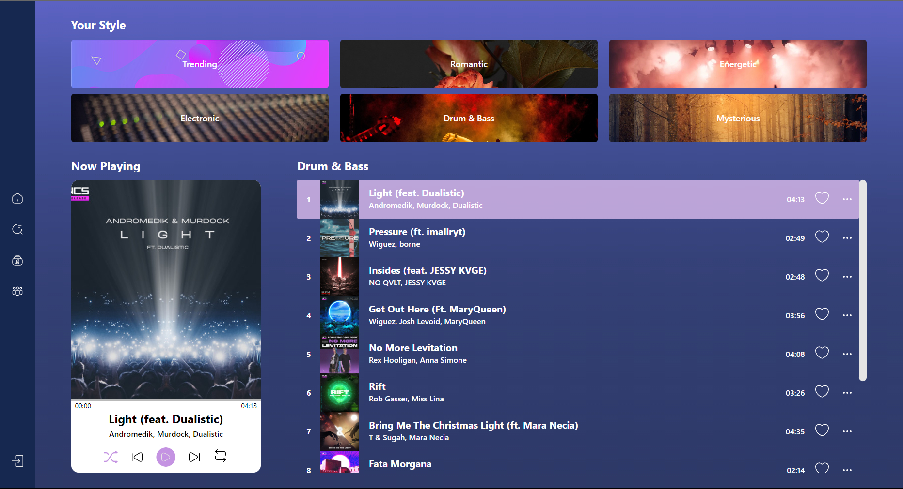
### SearchPage
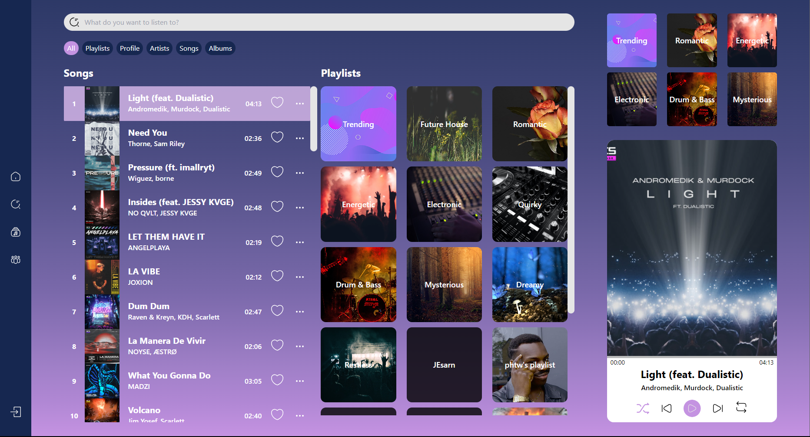
### PlaylistPage
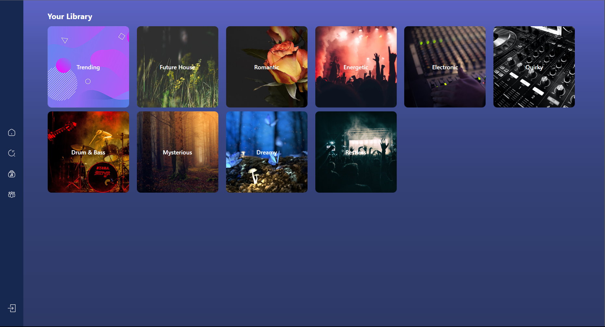
Due to contributors in group listen to a variety genre of music. So, we interest to developing music player  websites project in INT203 Client-Side Programming II for learning Vue3.


### Features

- Music Player
  - Music Controller
  - Playing Queue
  - Shuffle-able Queue
  - Draggable Progress Bar
- Playlist
  - Choose Any Track From Playlist
  - Add tracks to favorites
  
#### :sparkles: New :sparkles:
- Authentication 
  - Login
  - Register
- Search
  - Search tracks and playlists 
- Playlist
  - Create playlist 
  - Update playlist 
  - Delete playlist 
  - Like playlist


  
## Tech Stack

[Our Stack](https://stackshare.io/newbww/project1-sec-2-geegie-and-friends)

## Prerequisite and Installation
You would require the following tools to develop and run the project on your local machine:

- A text editor or an IDE (Recommended: _WebStorm_ or _Visual Studio Code_)
- _NodeJs_ v16.9.0 or later (Install [NodeJs](https://nodejs.org/en/download/))
- _Yarn_ for package management. (Install Yarn through the [_npm package manager_](http://npmjs.org/))

  ```
  npm install --global yarn
  ```

  Check the version of Yarn by running:

  ```
  yarn --version
  ```


## Customize configuration

See [Vite Configuration Reference](https://vitejs.dev/config/).

## Running the App

Steps and commands for running the app:

### Compile and Hot-Reload for Development

```sh
yarn dev
```

### Compile and Minify for Production

```sh
yarn build
```

### Preview for Production

```sh
yarn preview
```

### App Instructions

#### Music Player Card

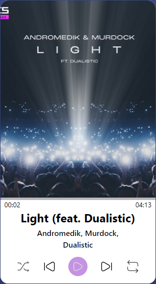

- Play/Pause button for toggle play-pause track
- Shuffle button for shuffle queue
- Skip button for skip to next/previous track
- Loop button for loop queue in playlist

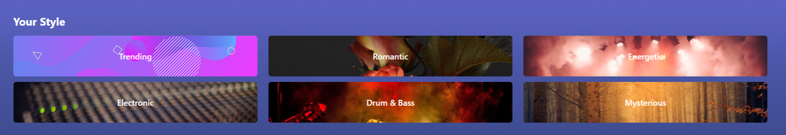

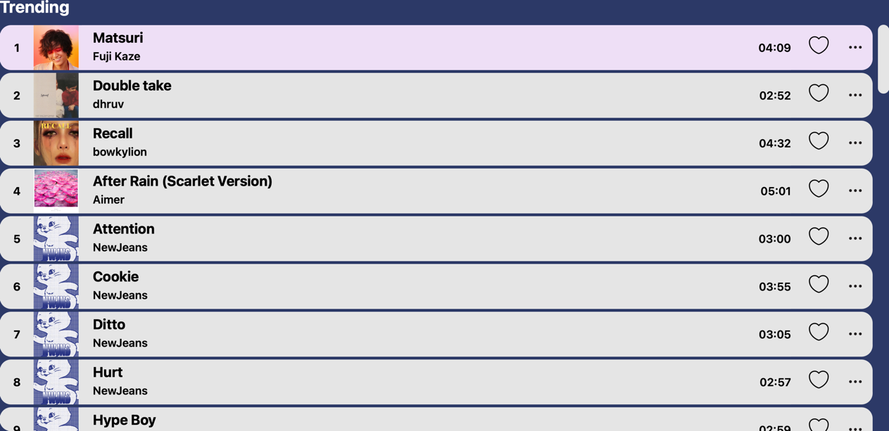
- You can change tracks in playlist by click playlist that you want
- Add track to favourites by clicking on the heart icon

### Search
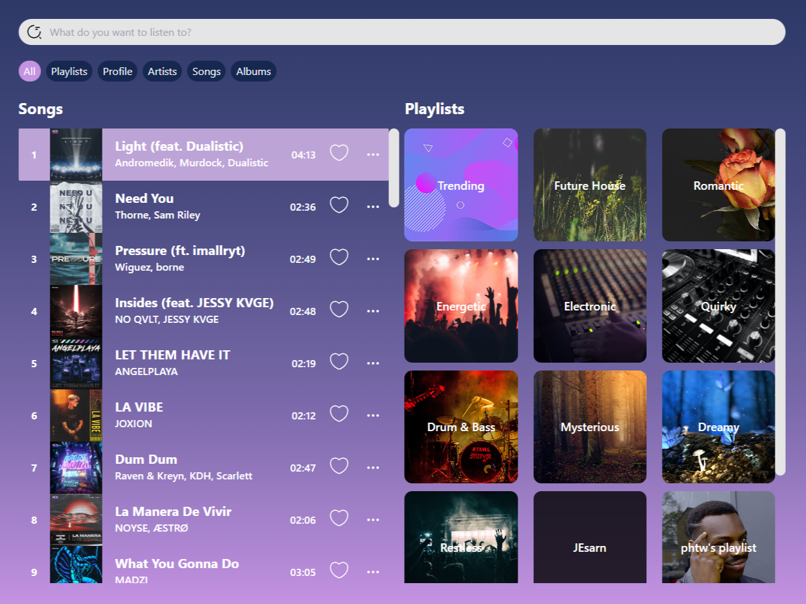
- You can search track and playlist by name and keywords
- You can select filter to search only playlists or songs

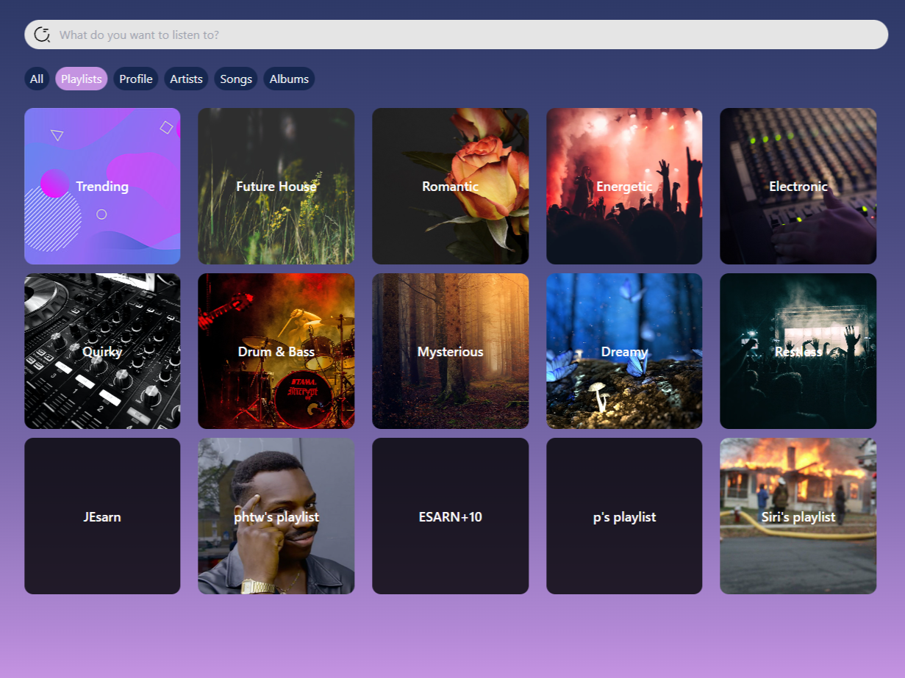

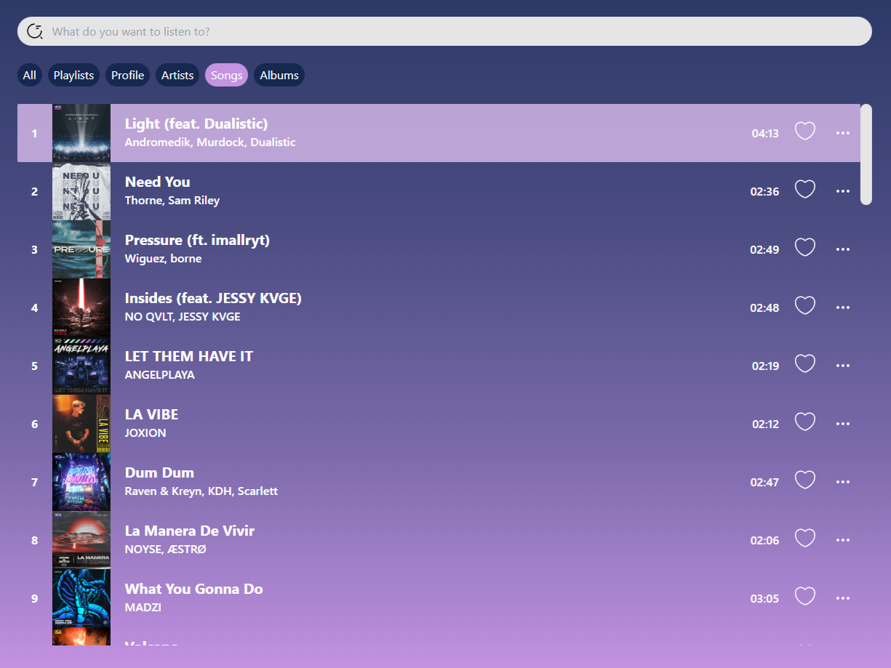

### Playlist

- You can see your playlist library when you login

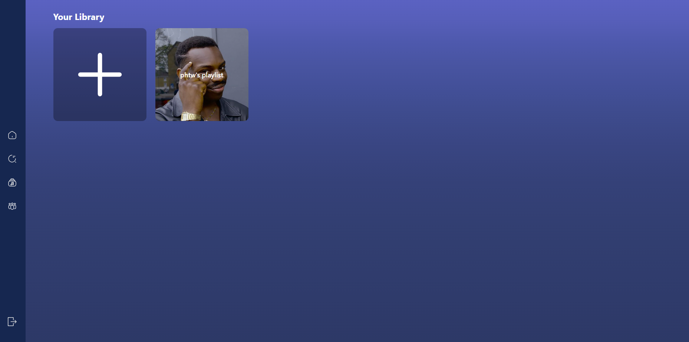

- you can view tracks in playlist
- create by click add playlist
- update playlist by click meatballs menu button

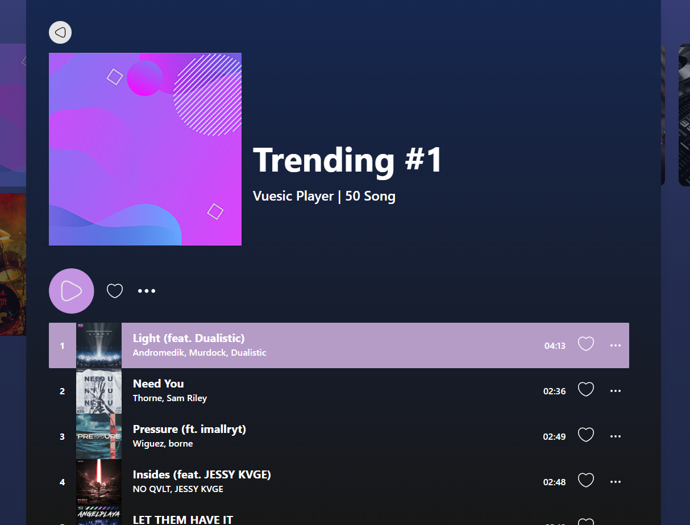
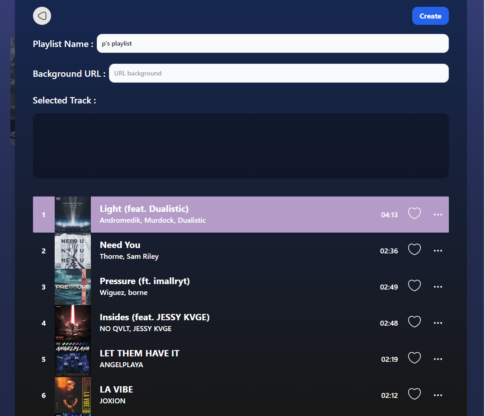
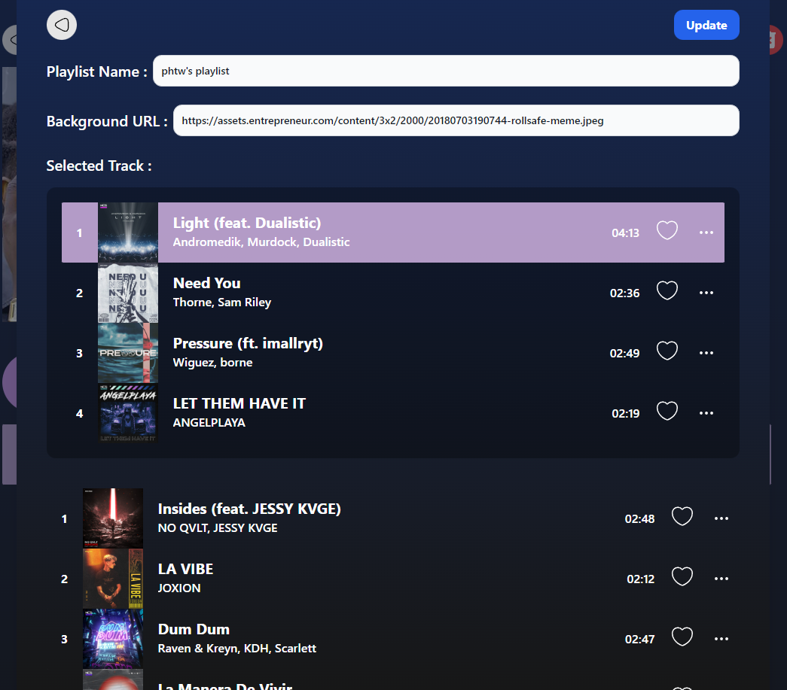

### Credit and Inspirations

- [Music Player Web App](https://dribbble.com/shots/18946599-Music-Player-Web-App) (Dribble)
- [Web Music Player Concept](https://dribbble.com/shots/19753283-Web-Music-Player-Concept) (Dribble)
- [Spotify](https://www.spotify.com/)
