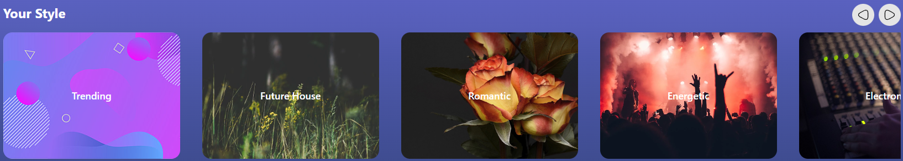
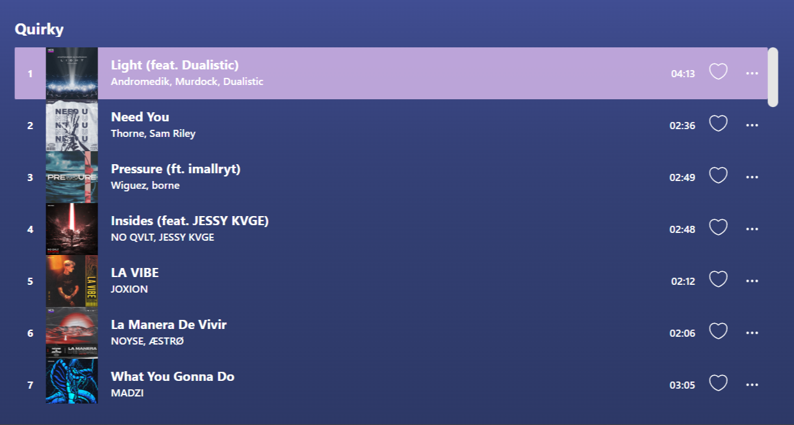

# INT203 Project #1: GeegieAndFriends's Vuesic Player
## Group: _GeegieAndFriends_

Our team including:

| Student ID  | Name                     | Email                      | Github Username | Contributions (%) |
|-------------|--------------------------|----------------------------|-----------------|-------------------|
| 64130500066 | Phutawan Palakavong      | Phutawan.pala@kmutt.ac.th  | pphtw           | 22.5              |
| 64130500079 | Siripoom Kusonsong       | Siripoom.kuso@kmutt.ac.th  | PhuMiZz         | 22.5              |
| 64130500080 | Supapit Krawsaikom       | Supapit.kraw@kmutt.ac.th   | supapitploy     | 10                |
| 64130500105 | Banlearit Siriboon       | Banlearit.siri@kmutt.ac.th | banlearit       | 22.5              |
| 64130500119 | Bowonwit Anothaisintavee | Bowonwit.anot@kmutt.ac.th  | NewBww          | 22.5              |

## Contributions

### Release V 1.0.0 (Music Player Option API)
- Music Player Layout (pphtw, banlearit)
- Play/Pause (banlearit)
- Skip track (banlearit)
- Progress bar (pphtw, banlearit)

### Release V 2.0.0
- Homepage UI (PhuMiZz, NewBww)
- Change Option API to Composition API (banlearit)
- Music controller (NewBww, banlearit)
- Drag-to-Seek Progress Bar (banlearit, PhuMiZz)
- Carousel Playlist (pphtw)
- Music Queuing System (NewBww)
- Music Choosing From Trending Section (PhuMiZz)
- Shuffle Song in Queue (NewBww)

### Release V 2.1.0
- Toggle playlist (pphtw)
- Favorite tracks (supapitploy)
- Improve performance (NewBww)
- Marquee (PhuMiZz)
- Scroll playlist (PhuMiZz)
- Split icon to Component (banlearit)
- Keyboard Music Controller (NewBww)


## Overview
Due to contributors in group listen to a variety genre of music. So, we interest to developing music player  websites project in INT203 Client-Side Programming II for learning Vue3.

### Features

- Music Player
  - Music Controller
  - Playing Queue
  - Shuffle-able Queue
  - Draggable Progress Bar
- Playlist
  - Choose Any Track From Playlist
  - Add tracks to favorites

## Tech Stack

[Our Stack](https://stackshare.io/newbww/project1-sec-2-geegie-and-friends)

## Prerequisite and Installation
You would require the following tools to develop and run the project on your local machine:

- A text editor or an IDE (Recommended: _WebStorm_ or _Visual Studio Code_)
- _NodeJs_ v16.9.0 or later (Install [NodeJs](https://nodejs.org/en/download/))
- _Yarn_ for package management. (Install Yarn through the [_npm package manager_](http://npmjs.org/))

  ```
  npm install --global yarn
  ```

  Check the version of Yarn by running:

  ```
  yarn --version
  ```


## Customize configuration

See [Vite Configuration Reference](https://vitejs.dev/config/).

## Running the App

Steps and commands for running the app:

### Compile and Hot-Reload for Development

```sh
yarn dev
```

### Compile and Minify for Production

```sh
yarn build
```

### Preview for Production

```sh
yarn preview
```

### App Instructions

#### Music Player Card


- Play/Pause button for toggle play-pause track
- Shuffle button for shuffle queue
- Skip button for skip to next/previous track




- You can scroll to view all playlist by click previous / next button on top right screen and select playlist for your music taste, then track list in the right screen will change you can select track from that too

### Credit and Inspirations

- [Music Player Web App](https://dribbble.com/shots/18946599-Music-Player-Web-App) (Dribble)
- [Web Music Player Concept](https://dribbble.com/shots/19753283-Web-Music-Player-Concept) (Dribble)
- [Spotify](https://www.spotify.com/)